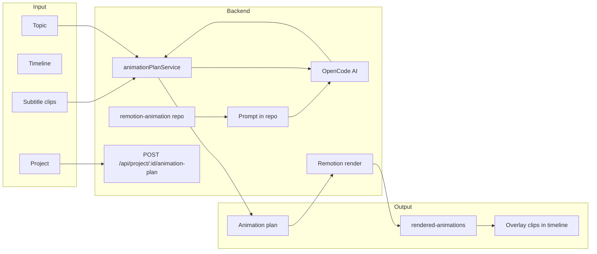

# Remotion Animation Overlay System for Stewie-Peter

## User flow (where Animation fits)

1. User opens project, adds template, adds session, adds background music (optional), etc.
2. User adds **characters and subtitles** via the **Subtitles & Characters** button.
3. From here the user has **three plan buttons**: **SFX**, **Image**, **Animation**.
4. **Animation** (like Image and SFX): analyzes the script, decides **where** to add animation, **what** animation, and **duration**; then **renders** the overlay videos, stores them in `backend1/storage/rendered-animations`, and adds them to the timeline. For now, show animation overlays in the **exact same position as image plan** and **manage aspect ratio** the same way (e.g. `computeOverlayPlacement` + `force_original_aspect_ratio=decrease`).

## Goal

- **Remotion repo**: [backend1/storage/remotion-animation](backend1/storage/remotion-animation) is the existing Remotion project. **Per project**: create a **separate folder** inside it (e.g. `remotion-animation/proj_<projectId>/`) when generating animation for that project; **delete** this folder when the project is deleted.
- **OpenCode**: Analyzes script (dialogue + timestamps), decides where/what/duration for each animation moment; outputs plan JSON (moments + videoDurationSeconds).
- **Render**: For each project, use the plan to **render** overlay video(s) via Remotion (local `npx remotion render` or Lambda). Store rendered file(s) in **[backend1/storage/rendered-animations](backend1/storage/rendered-animations)** (e.g. `rendered-animations/proj_<projectId>/moment_0.mp4`, … or one video per moment).
- **Timeline**: Use the rendered animation videos in the **video** via the timeline — same as image plan: overlay track(s) with clips that have `path` to the rendered file, **exact position as image plan** (same x, y, scale; e.g. center-bottom), and **aspect ratio** managed in ffmpeg (e.g. `force_original_aspect_ratio=decrease` in overlay scale).
- **Cleanup**: When a project is **deleted**, delete the project's folder in `remotion-animation` and the project's folder/files in `rendered-animations`.

---

## Architecture (high level)

- **Per-project folder**: Create `remotion-animation/proj_<projectId>/` when generating animation; **delete** it when the project is deleted.
- **OpenCode**: Analyzes script (subtitle clips → dialogue with timestamps), outputs plan JSON (moments: start, duration, type, content).
- **Render**: Run Remotion render per moment (or one composition); save **video file(s)** to `backend1/storage/rendered-animations/proj_<projectId>/` (e.g. `moment_0.mp4`, …).
- **Timeline**: Add **overlay** track(s) with clips whose `path` points to rendered files in `rendered-animations`. **Exact same position as image plan** (x, y, scale; e.g. 0.5, 0.65, 0.5) and same **aspect ratio** handling ([computeOverlayPlacement](backend1/src/service/overlayTransform.ts) + `force_original_aspect_ratio=decrease` in ffmpeg). Reuse image-plan overlay pipeline (e.g. t_anim or t_imgs-style overlay tracks).
- **Project delete**: In [projectService.deleteProject](backend1/src/service/projectService.ts), also delete `storage/remotion-animation/proj_<projectId>/` and `storage/rendered-animations/proj_<projectId>/`.

---

## 1. Remotion repo (existing), per-project folder, and storage

- **Repo**: [backend1/storage/remotion-animation](backend1/storage/remotion-animation) is the existing Remotion project (Root, MyComp, TextFade, Lambda render API).
- **Per-project folder**: For each project, create **`remotion-animation/proj_<projectId>/`** when generating animation (e.g. project-specific inputProps/plan JSON for render). **Delete** this folder when the project is deleted.
- **Rendered videos**: Store rendered overlay video(s) in **[backend1/storage/rendered-animations](backend1/storage/rendered-animations)** (e.g. `rendered-animations/proj_<projectId>/moment_0.mp4`, …). **Delete** this project subfolder when the project is deleted.
- **Inside the repo** (shared): Prompt file (e.g. `ANIMATION_OVERLAY_PROMPT.md`); overlay composition (e.g. `StewiePeterOverlay`) that accepts plan as `inputProps` and renders one or more moments; schema for composition props.

---

## 2. Backend: Animation plan, render, overlay track, and project delete

- **New service**: [backend1/src/service/animationPlanService.ts](backend1/src/service/animationPlanService.ts).
  - **Types**: `AnimationMoment` (start, duration, type, content), `AnimationPlan` (moments[], videoDurationSeconds?).
  - **Plan**: Build dialogue from subtitle clips; load prompt from remotion-animation repo; call OpenCode (`generateAnimationPlanWithResearch`); parse to `AnimationPlan`.
  - **Per-project folder**: Create `storage/remotion-animation/proj_<projectId>/` (e.g. write plan JSON for render). Create `storage/rendered-animations/proj_<projectId>/` if needed.
  - **Render**: For each moment (or one composition with full plan), run Remotion render (e.g. `npx remotion render` from remotion-animation root or Lambda). Save output to `rendered-animations/proj_<projectId>/moment_<i>.mp4` (or similar).
  - **Overlay track (same as image plan)**: Build overlay clips with `kind: 'overlay'`, `path` = path to rendered file (e.g. `rendered-animations/proj_<id>/moment_0.mp4`), `start`, `duration`, **same x, y, scale as image plan** (e.g. x: 0.5, y: 0.65, scale: 0.5). Use track id `t_anim` / `t_anim_2` (like t_imgs) so preview/export treat them as overlay inputs; reuse [computeOverlayPlacement](backend1/src/service/overlayTransform.ts) and `force_original_aspect_ratio=decrease` for **aspect ratio**. Merge these overlay tracks into timeline (replace existing t_anim*).
- **Controller**: `generateAnimationPlanForProject`: get project, subtitles, duration → plan → create proj folder → render → save to rendered-animations → build overlay tracks → merge into timeline → `updateTimeline`; return `{ success, animationPlan, project, timeline }`.
- **Project delete**: In [projectService.deleteProject](backend1/src/service/projectService.ts), after deleting the project file, delete directories `storage/remotion-animation/proj_<projectId>/` and `storage/rendered-animations/proj_<projectId>/` if they exist.

---

## 3. Frontend: Animation Plan button and state

- **API**: In [client1/src/config/api.ts](client1/src/config/api.ts), add e.g. `generateAnimationPlan: (projectId: string) => \`${API_BASE_URL}/api/project/${projectId}/animation-plan`.
- **Editor state**: In [client1/src/app/components/editor/EditorLayout.tsx](client1/src/app/components/editor/EditorLayout.tsx):
  - `hasAnimationPlan`: true when any track is animation overlay (e.g. `t.id === 't_anim' || /^t_anim_\d+$/.test(t.id)`) and has clips (same pattern as `hasImagePlan`).
  - `isGeneratingAnimationPlan` state; `handleGenerateAnimationPlan`: POST to `API_ENDPOINTS.generateAnimationPlan(project.id)` with optional `{ topic: project.name }`, on success refresh project/timeline and set success message.
- **Timeline toolbar**: In [client1/src/app/components/editor/VideoTimelinePanel.tsx](client1/src/app/components/editor/VideoTimelinePanel.tsx):
  - Add props: `onGenerateAnimationPlan`, `isGeneratingAnimationPlan`, `hasAnimationPlan`.
  - Add an "Animation Plan" button next to "SFX Plan" (same UX pattern: disabled while generating, distinct color e.g. green/teal so it’s clearly "animation").
- **Timeline**: Animation clips are **overlay** type (like image plan). Order overlay tracks so t_anim / t_anim_N appear with other overlay tracks. Clip label: content snippet or "Animation 1".

---

## 4. Data flow summary

| Step | Data |
| ---- | ---- |
| 1 | User clicks "Animation Plan" in editor. |
| 2 | Frontend POSTs to `/api/project/:id/animation-plan` with optional `{ topic }`. |
| 3 | Backend loads project, timeline, subtitle clips; creates `remotion-animation/proj_<id>/` and reads prompt from remotion-animation. |
| 4 | Service builds dialogue; OpenCode returns plan JSON; parse to `AnimationPlan`. |
| 5 | For each moment: run Remotion render; save video to `rendered-animations/proj_<id>/moment_<i>.mp4`. |
| 6 | Build overlay tracks (t_anim / t_anim_N) with clips: path to rendered file, start, duration, x/y/scale same as image plan; merge into timeline; updateTimeline. |
| 7 | Response returns animationPlan and updated project/timeline; frontend refreshes. On project delete: remove `remotion-animation/proj_<id>/` and `rendered-animations/proj_<id>/`. |

---

## 5. Out of scope (later)

- **Overlay vs cut-in**: Choosing overlay vs cut per moment can be a later enhancement.
- **Progress UI**: If render is slow, add progress or polling for animation-plan endpoint.
- **Preview of animation content**: Optional: show list of moments in sidebar with timestamps and content.

---

## 6. Files to create or modify (concise)

**Storage**
- Ensure `backend1/storage/rendered-animations/` exists (create on first use). Per-project: `rendered-animations/proj_<projectId>/`.
- Per-project folder in repo: `remotion-animation/proj_<projectId>/` (create when generating animation; delete when project deleted).

**Inside Remotion repo** (`backend1/storage/remotion-animation/`)

| Action | File |
| ------ | ---- |
| Create | `ANIMATION_OVERLAY_PROMPT.md` — prompt for OpenCode, tiers + JSON schema |
| Create | `src/remotion/StewiePeterOverlay/` — composition with plan as inputProps, renders overlay sequences |
| Modify | `src/remotion/Root.tsx` — register overlay composition |
| Modify | `types/constants.ts` and/or `types/schema.ts` — overlay composition props |

**Backend (aislop backend1)**

| Action | File |
| ------ | ---- |
| Create | `backend1/src/service/animationPlanService.ts` (plan, proj folder, render, overlay tracks, paths to rendered-animations) |
| Modify | `backend1/src/agents/gemini3agent.ts` — add `generateAnimationPlanWithResearch` |
| Modify | `backend1/src/controllers/projectController.ts` — handler `generateAnimationPlanForProject` |
| Modify | `backend1/src/service/projectService.ts` — in `deleteProject`, delete `remotion-animation/proj_<id>/` and `rendered-animations/proj_<id>/` |
| Modify | `backend1/src/service/previewGenerator.ts` and `timelineCompiler.ts` — include t_anim / t_anim_N overlay tracks (same as t_imgs) so animation overlays are composited with same placement and aspect ratio |
| Modify | `backend1/src/routes/register.ts` — route `POST /api/project/:id/animation-plan` |

**Frontend**

| Action | File |
| ------ | ---- |
| Modify | `client1/src/config/api.ts` — animation-plan endpoint |
| Modify | `client1/src/app/components/editor/EditorLayout.tsx` — hasAnimationPlan (t_anim*), handler, pass props |
| Modify | `client1/src/app/components/editor/VideoTimelinePanel.tsx` — Animation Plan button + props |
| Modify | Timeline ordering so t_anim overlay tracks appear with overlay section; clip label for overlay clips from rendered path |

---

## 7. OpenCode, render, and timeline usage

- **OpenCode**: Reuse [gemini3agent](backend1/src/agents/gemini3agent.ts) `opencodeRun`, `parseOpenCodeJSON`. New function loads prompt from remotion-animation repo, injects dialogue + duration, returns plan JSON.
- **Render**: After plan is ready, create per-project folder in remotion-animation, run Remotion render (per moment or one composition), save output to `rendered-animations/proj_<id>/`.
- **Timeline**: Overlay tracks t_anim / t_anim_N use `kind: 'overlay'`, `path` to rendered video; same x, y, scale as image plan; preview and export include these tracks (same pipeline as t_imgs: computeOverlayPlacement + force_original_aspect_ratio=decrease for aspect ratio).
- **Project delete**: Remove `remotion-animation/proj_<id>/` and `rendered-animations/proj_<id>/` in deleteProject.

