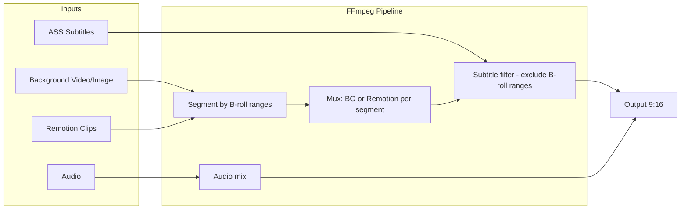

# Video Styles, Media Combo, and Remotion Improvements

## 1. New Video Making Style: Single Voice Character with Image

### 1.1 Config Layer

- **[backend1/src/config/tts-config.ts](backend1/src/config/tts-config.ts)** (and `backend/` if used): Add a new character entry, e.g. `Narrator` or `Host`, with placeholder `gpt`, `sovits`, `referenceAudio`, `promptText`, `promptLang`. Include a `videoStyleId` or `characterSet` concept if we need to map styles to character sets.
- **[backend1/src/utils/characterImages.ts](backend1/src/utils/characterImages.ts)**: Make `NAMES` extensible—support a new character (e.g. `Narrator: 'narrator.png'`). Use a placeholder path; image can be added later. Update `CHARACTER_NAMES` export.

### 1.2 Script and Conversation

- **[backend1/src/service/assistants.ts](backend1/src/service/assistants.ts)**: Add `generateSingleCharacterScript(topic, characterId)` that returns a single-speaker script (one character, multiple lines). Reuse/adapt system prompts for educational Instagram Reel style.
- Add a schema or type for single-character conversation format (array of `{ text: string }` or similar).

### 1.3 Audio Generation

- **[backend1/src/controllers/audioController.ts](backend1/src/controllers/audioController.ts)** (`generateAudioFromScript`): Accept a `videoStyle` or `characterSet` param. When style is `single_voice`, use single-character script format and the configured character from TTS config. Validate character against `TTS_CONFIG.characters` keys instead of hardcoded `['Stewie','Peter']`.

### 1.4 Video Style Presets

- **[backend1/src/config/video-styles.ts](backend1/src/config/video-styles.ts)**: Extend `VideoStyleId` with `single_voice` (or similar). Add preset with `characterSet: 'single'`, single character overlay, etc. Optionally add `defaultCharacter?: string` for TTS/UI.

### 1.5 Client UI: Conversation Generator and Audio Browser

- **[client1/src/app/components/ConversationGenerator.tsx](client1/src/app/components/ConversationGenerator.tsx)**: Add video style selector (Stewie+Peter vs Single voice). When single voice selected, show character picker (from API/config) and placeholder for character image upload. Call script API with `videoStyle`/`characterSet`.
- **[client1/src/app/components/AudioBrowser.tsx](client1/src/app/components/AudioBrowser.tsx)**: Add optional filter or label by video style/character so users can distinguish single-voice sessions from Stewie+Peter.

### 1.6 Editor

- **[client1/src/app/components/editor/*](client1/src/app/components/editor/)**: Ensure character track and overlay logic support a single character. Character clips should reference the active character from the session/project (e.g. `Narrator`). Use `getCharacterImagePath` with the new character key; fallback to placeholder if image missing.

---

## 2. Background and Media Combo (9:16)

### 2.1 Current State

- Project `template` supports video or image from `storage/video_templates`.
- Overlay tracks support images and videos (via `addOverlayInput` in [backend1/src/service/timelineCompiler.ts](backend1/src/service/timelineCompiler.ts) - `stream_loop` for video, `loop 1` for images).
- Remotion clips are rendered as mp4 and added to overlay tracks; currently used as overlays on top of background.

### 2.2 B-roll Cut Support

Introduce a new clip mode: **replace** vs **overlay**.

- **Schema**: Extend `OverlayClipSchema` in [backend1/src/schema/project.ts](backend1/src/schema/project.ts) with optional `displayMode?: 'overlay' | 'replace'`. Default `overlay` for backward compatibility.
- **Animation Plan Service**: When creating overlay clips from Remotion moments, set `displayMode: 'replace'` for B-roll cuts.
- **Timeline Compiler**: For clips with `displayMode === 'replace'`:
  - Treat the Remotion clip as a **background replacement** during its time range.
  - Use FFmpeg `concat` or overlay with `enable` + scaled full-frame so the Remotion clip fills 1080x1920 during that segment.
  - Build a concat-based timeline: `[background segments]` + `[Remotion B-roll segments]` stitched by time, then apply global subtitles only to non-B-roll segments (or omit subtitles during B-roll; text is baked into Remotion).

### 2.3 Subtitle Behavior During B-roll

- **Global subtitles**: Disabled during B-roll replace segments (via ASS `Dialogue` with `enable` conditions or by generating ASS only for non-B-roll ranges).
- **Remotion clip content**: Pass the full text for that moment into the Remotion composition. Render as **static text** (all at once) styled to match the animation. No word-level timing inside Remotion.

### 2.4 FFmpeg Strategy

- Option A: Use `concat demuxer` to build a sequence of segments (background vs Remotion) based on clip time ranges.
- Option B: Use overlay with `enable=between(t,start,end)` and scale Remotion to full frame, effectively replacing the background visually. Simpler but overlay stack order must put Remotion “below” subtitle layer during replace.

Recommend **Option B** for first pass: scale Remotion clip to 1080x1920, overlay it with `enable` during its time range. Background is input 0; Remotion is another input. Filter chain: `[0:v][remotion]overlay=0:0:enable='...'` with Remotion scaled to full frame. Subtitle filter applied only when not in a B-roll window (or use ASS events that exclude B-roll time ranges).

---

## 3. Remotion Animation Prompt Improvements

### 3.1 Current State

- Prompt lives at `storage/remotion-animation/ANIMATION_OVERLAY_PROMPT.md` or fallback in [backend1/src/service/animationPlanService.ts](backend1/src/service/animationPlanService.ts) (lines 221-247).
- Fallback is minimal: "plan short animation overlay moments", basic JSON shape, little creative guidance.

### 3.2 Improvements

Create/update `ANIMATION_OVERLAY_PROMPT.md` with:

- **Purpose**: Plan B-roll moments that replace the background with educational callouts, diagrams, or key points.
- **Format**: 9:16 vertical, ~1–6 seconds per moment.
- **Content rules**: Concise text (suitable for static display), one key idea per moment, avoid jargon-heavy phrases.
- **Timing**: Spread moments across the video; avoid clustering. Sync with natural dialogue breaks.
- **Types**: Callout, diagram, definition, step, highlight, quote—with brief descriptions.
- **Output**: Strict JSON with `moments` array: `{ start, duration, type, content }`.
- **Examples**: 2–3 good/bad examples to steer the model.

Update the fallback string in `animationPlanService.ts` to mirror these rules if the file is missing.

---

## 4. Remotion Composition: Static Text and B-roll

### 4.1 Pass Text and Duration

- [backend1/src/service/animationPlanService.ts](backend1/src/service/animationPlanService.ts): When calling `renderMomentWithRemotion`, pass `content` (full text for the moment) and `duration`. The Remotion composition should accept these as props.
- Ensure the Remotion project (under `storage/remotion-animation`) has a composition that:
  - Accepts `content: string` and `duration: number`.
  - Renders the text as static (no word-level timing).
  - Styling (font, colors, layout) matches the animation theme.

### 4.2 Composition Updates

- If the Remotion project is in-repo, add a `content` prop and a text component. If it’s external, document the expected props and provide a sample composition or template.

---

## 5. SFX

No changes. SFX stays as-is in timeline and mix.

---

## 6. Implementation Order

1. **TTS + character config**: Add Narrator (or similar) and extend `characterImages.ts`.
2. **Video style preset**: Add `single_voice` and wire to character set.
3. **Script + audio**: Single-character script generation and audio controller updates.
4. **Client**: Conversation generator style selector, character picker, placeholder image UI; audio browser filter.
5. **Editor**: Single-character support in character track and overlay.
6. **Overlay clip schema**: Add `displayMode`.
7. **Animation plan + Remotion**: Update prompt, pass `content` to composition, render static text.
8. **Timeline compiler**: Handle `displayMode: 'replace'` (B-roll), subtitle exclusion during B-roll, full-frame Remotion overlay.

---

## 7. Files to Modify (Summary)

| Area     | Files                                                                                                          |
| -------- | -------------------------------------------------------------------------------------------------------------- |
| Config   | `tts-config.ts`, `characterImages.ts`, `video-styles.ts`                                                       |
| Backend  | `assistants.ts`, `audioController.ts`, `animationPlanService.ts`, `timelineCompiler.ts`, `project.ts` (schema) |
| Client   | `ConversationGenerator.tsx`, `AudioBrowser.tsx`, editor components                                             |
| Remotion | `ANIMATION_OVERLAY_PROMPT.md`, Remotion composition (props + static text)                                      |

---

## 8. Diagram: B-roll Replace Flow

